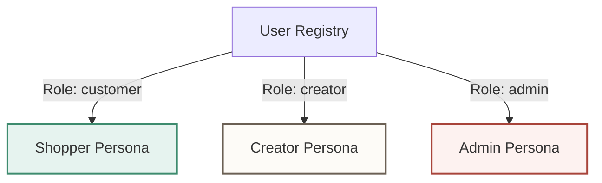
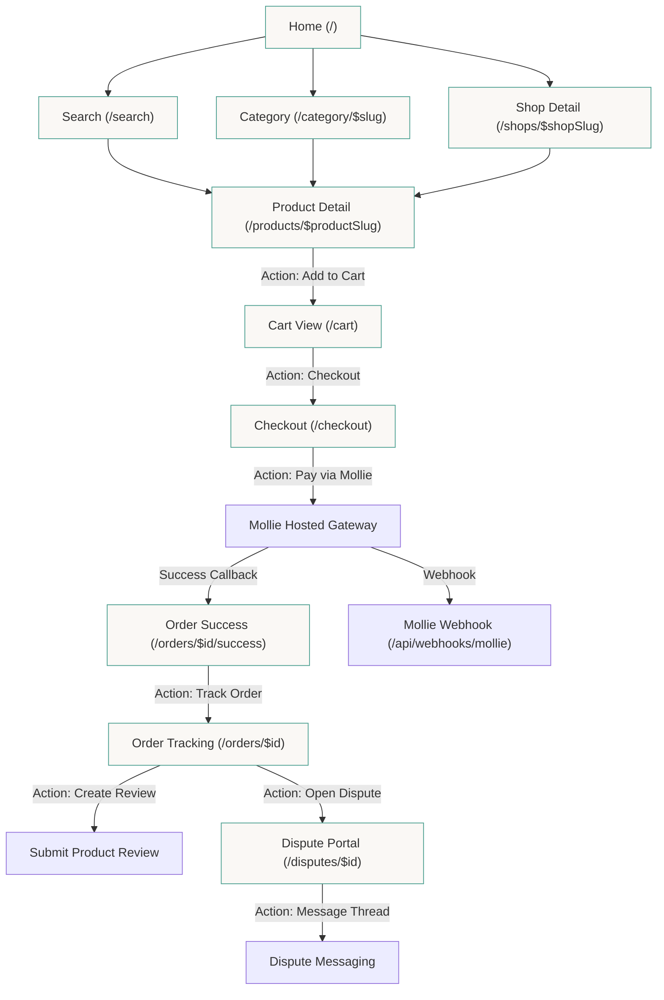
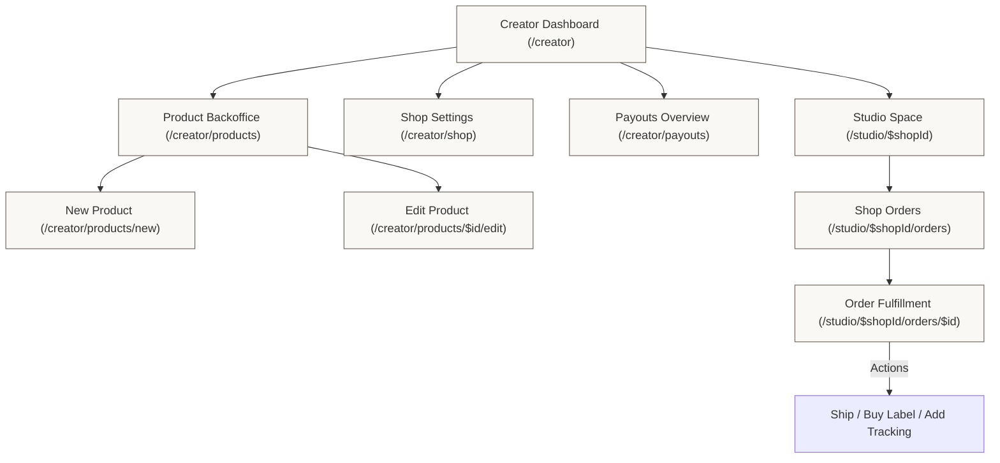
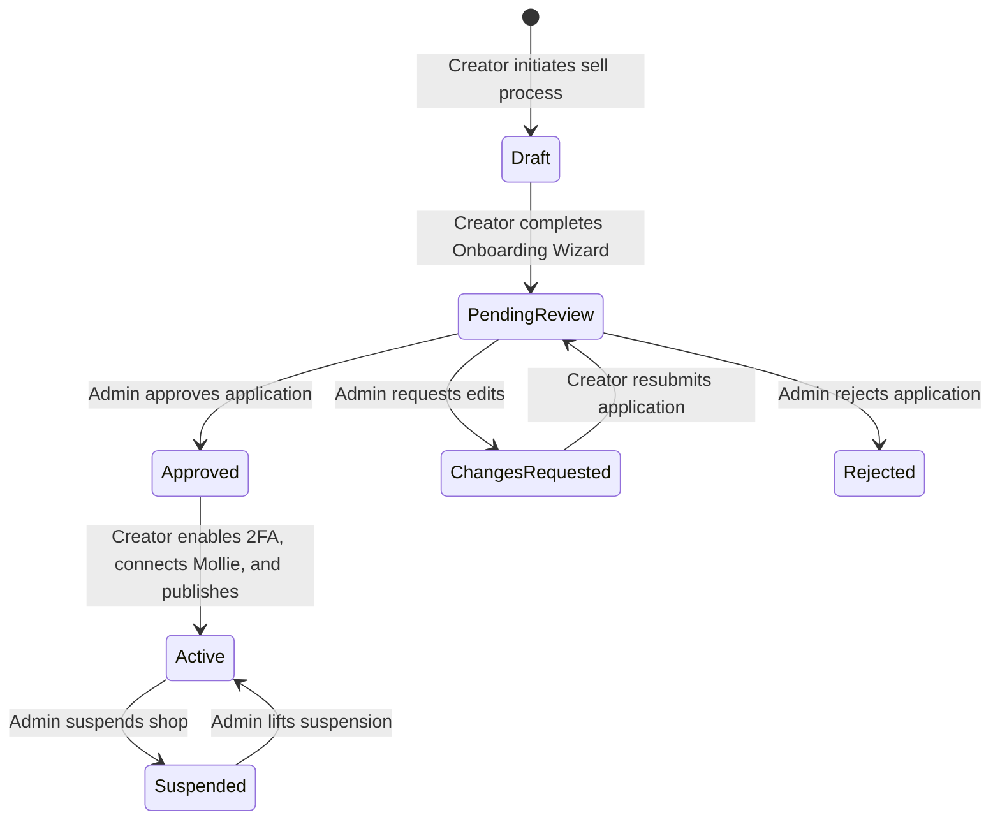
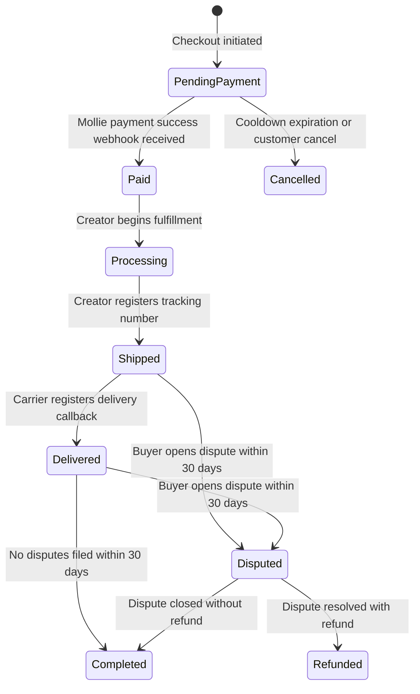

# Eurtisan: Comprehensive User Flow & Current Actions Audit

This document provides a detailed mapping of all user flows, lifecycle transitions, and features currently implemented in Eurtisan. It analyzes the application across its three primary personas: **Shoppers**, **Shop Owners (Creators)**, and **Admins**. 

---

## 1. System Topology & User Personas

Eurtisan distinguishes three primary roles via the `user_role` enumeration:

1. **Shopper (Customer)**: Public visitors and authenticated buyers.
2. **Shop Owner (Creator)**: Artisans who configure storefronts, manage products, and fulfill orders.
3. **Admin**: Platform moderators responsible for shop approvals, dispute resolution, payout processing, and auditing.

---

## 2. Shopper User Flow & Available Actions

Shoppers interact with discovery channels, cart management, checkout processes, and post-purchase activities.

### Shopper Flow Overview

### Available Actions Right Now (Shopper)
*   **Search & Discovery**:
    *   **Keyword Search**: Query search indexing using Meilisearch.
    *   **Browse Categories**: Navigate nested category structures and view items filtered by category slug.
    *   **Browse Shop Fronts**: Read announcements, shop location details, shipping policies, and view products from specific sellers.
    *   **Inspect Products**: View images, categories, prices in Euros, remaining stock levels, and historical buyer reviews.
*   **Cart Actions**:
    *   **Anonymous Session Cart**: Add items as a guest. Session data is stored in the `cart` table mapping to a client-side cookie session ID.
    *   **Quantity Adjustments**: Increment/decrement counts, validating against available stock.
    *   **Cart Merging**: Guest carts automatically merge onto account carts upon successful login.
*   **Checkout & Order Placement**:
    *   **Place Order**: Complete a shipping and billing form validating address formats.
    *   **Inventory Reservation**: Lock product inventory temporarily (15-minute lease) during checkout to prevent double-selling.
    *   **Complete Payment**: Transact via the Mollie integration.
*   **Post-Purchase**:
    *   **Track Shipments**: View order tracking numbers, carrier details, and status history.
    *   **Rate & Review**: Leave a star rating and written review per product from completed orders.
    *   **File Dispute**: Initiate formal dispute resolution within 30 days of order placement.

---

## 3. Creator (Shop Owner) Flow & Available Actions

The Creator workflow consists of two parts: a strict multi-step Onboarding Wizard, followed by a backoffice/studio space for operational management.

### Shop Onboarding Flow

```mermaid
graph LR
    classDef step fill:#faf8f5,stroke:#3d8b6e,stroke-width:1px;
    
    Start[Sell Landing] --> S1["Step 1: Identity & Name"]:::step
    S1 --> S2["Step 2: Brand Story"]:::step
    S2 --> S3["Step 3: Upload Visuals"]:::step
    S3 --> S4["Step 4: Origin & Currency"]:::step
    S4 --> S5["Step 5: Setup Policies"]:::step
    S5 --> S6["Step 6: Add Social Links"]:::step
    S6 --> S7["Step 7: First Listing"]:::step
    S7 --> S8["Step 8: Agree & Submit"]:::step
    S8 --> Status["Approval Status Screen"]
```

### Backoffice & Studio Flow

### Available Actions Right Now (Creator)
*   **Onboarding Wizard**:
    *   **Submit Draft**: Progress step-by-step through location, identity (slug generation with collision checking), story details, visuals upload, policies config, socials, and adding an initial product.
    *   **Check Review Status**: Check whether their shop status is `draft`, `pending_review`, `approved`, `active`, `rejected`, or `suspended`.
*   **Inventory & Products**:
    *   **List Products**: Create products under categorized fields, defining stock quantities and price in cents.
    *   **Edit Details**: Modify name, description, tags, category alignment, and product photo uploads.
    *   **Deactivate/Reactivate**: Toggle status (`isActive`) to instantly hide/show products across the marketplace.
*   **Order Fulfillment**:
    *   **Inspect Customer Orders**: View items ordered, shipping methods chosen, and customer addresses.
    *   **Update Fulfillment Status**: Mark orders as `processing` and `shipped`.
    *   **Fulfill Shipping**: Assign carrier, tracking numbers, and tracking URLs. Generate and buy shipping labels.
*   **Financials**:
    *   **Track Earnings**: View pending balances and historic payout records.

---

## 4. Admin Flow & Available Actions

Admins act as platform moderators. They oversee shops, users, platform transactions, categories, and audit events.

### Admin Panel Route Structure

```mermaid
graph TD
    classDef route fill:#faf8f5,stroke:#a8443a,stroke-width:1px;
    
    AdminRoot["Admin Shell (/admin/__root)"]:::route --> Dashboard["Dashboard (/admin/)"]:::route
    AdminRoot --> Shops["Shop Moderation (/admin/shops)"]:::route
    AdminRoot --> Products["Catalog Moderation (/admin/products)"]:::route
    AdminRoot --> Categories["Category CRUD (/admin/categories)"]:::route
    AdminRoot --> Users["User Directory (/admin/users)"]:::route
    AdminRoot --> Orders["All Platform Orders (/admin/orders)"]:::route
    AdminRoot --> Payouts["Payout Oversight (/admin/payouts)"]:::route
    AdminRoot --> Disputes["Dispute Center (/admin/disputes)"]:::route
    AdminRoot --> Audit["System Audit Logs (/admin/audit-log)"]:::route
```

### Available Actions Right Now (Admin)
*   **Moderation & Safety**:
    *   **Review Onboarding Applications**: The dashboard and admin shell show the pending-review count and link directly to the queue. Admins can inspect the complete application, approve or reject it, or request changes for a specific onboarding stage with feedback shown to the maker.
    *   **Suspend Shops**: Instantly toggle suspensions on active shops, which hides their products from public search indices and storefronts.
    *   **Ban Users**: Permanently ban problematic buyers or sellers, blocking their authenticated sessions.
*   **Catalog & Content Management**:
    *   **Category CRUD**: Create, edit, and delete marketplace categories. Reorder them via drag-and-drop ordering schemas.
    *   **Product Oversight**: Monitor and toggle visibility parameters (`isActive`) for any product listing across any storefront.
*   **Dispute Mediation**:
    *   **Oversee Dispute Chat Threads**: View dispute messages exchanged between shopper and creator.
    *   **Resolve Disputes**: Direct resolution by closing the case, or issuing partial/full refunds triggering automated refund requests back to Mollie.
*   **Financials & System Health**:
    *   **Process Creator Payouts**: Review pending creator balances and flag payout entries as `sent` when bank wire transfers compile.
    *   **Audit Tracking**: Access a read-only event timeline logging who performed administrative adjustments, what resources were modified, and transaction metadata.

---

## 5. Key Lifecycle State Transitions

The core of Eurtisan's business logic is driven by several strict state machines.

### 5.1 Shop Status Lifecycle

### 5.2 Order Status Lifecycle

---

## 6. Functional Checklists & Identified Gaps

To help prepare the application for v1.0 release, this checklist details what is fully built and where gaps remain.

### 6.1 Authentication & Profile Management
- [x] Email/password login and register (via Better Auth)
- [x] Cookie-based session validation
- [x] Guest and Authenticated cart merging
- [x] Rate limiting on authentication routes
- [x] Password recovery flows (`/forgot-password` and `/reset-password`)
- [x] Email verification flow (`/verify-email`)
- [x] Account settings management (`/account/settings`)

### 6.2 Buyer (Shopper) Flow
- [x] Homepage discovery layouts
- [x] Keyword search via Meilisearch
- [x] Category listing filters
- [x] Product detail pages
- [x] Add to cart & quantity selection
- [x] Check out with shipping address details
- [x] Mollie payment gateway integration
- [x] Post-checkout success route and receipt display
- [x] Order history lists (`/account/orders`)
- [x] Individual order detail & status timelines
- [x] Star rating & product feedback reviews
- [x] Open dispute form with reason classifications

### 6.3 Creator Flow
- [x] Five-stage physical-goods onboarding with draft persistence, moderation feedback, and explicit launch
- [x] Creator stats dashboard (overview charts, activity lists)
- [x] Product creation (with title slug generation and category mapping)
- [x] Image file uploads (written directly to the public asset server)
- [x] Edit product details
- [x] Active/Inactive status toggle
- [x] Shop settings configurations (taglines, descriptions, custom policies, visual banners)
- [x] Studio shop order lists
- [x] Tracking information registry (carrier, tracking link, routing details)
- [x] Dispute messaging chat thread
- [x] **GAP:** Mollie Connect onboarding (creators can connect their Mollie merchant account via the Payouts page).
- [ ] **GAP:** Automated shipping label purchases (current labels page handles simple tracking attachment but lacks API integration).

### 6.4 Admin Operations
- [x] Admin Role authentication guards (`guardRole('admin')`)
- [x] Unified layout shell (`AdminLayout`)
- [x] Basic stats overview cards (users, sales, orders, disputes)
- [x] Shop moderation listing (suspension control, pending application review detail overlays)
- [x] User management panel (search, promote roles, ban/unban status modifications)
- [x] Category administration (create, update, delete, reorder nodes)
- [x] Product oversight list
- [x] Audit logs feed (actor tracking metadata)
- [x] Order inspection table (paginated platform transactions)
- [x] Dispute details & resolution operations (refund callbacks)
- [x] Payout tracking queue
- [x] **GAP:** Trend visualization charts (Dashboard shows static numbers instead of charts).
- [x] **GAP:** Bulk management (e.g. bulk suspensions, bulk payout approvals).
- [x] **GAP:** CSV reports export downloads.
